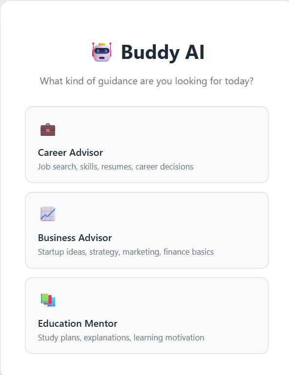
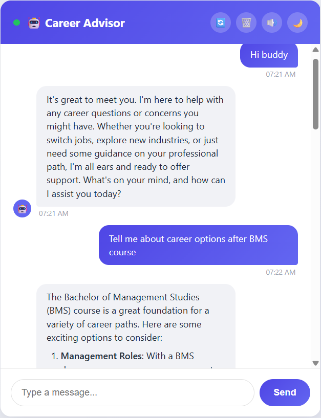
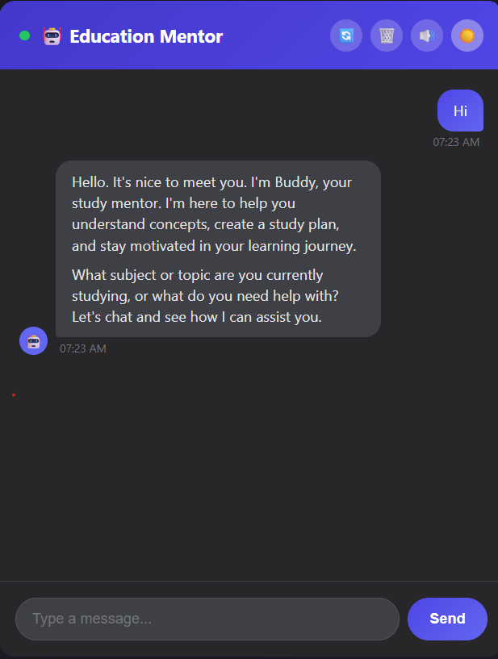

# 🤖 Buddy AI Chatbot

> **Multi-Advisor AI Chatbot** — A full-stack Flask web app powered by Groq + Llama 3.3 with three specialized AI advisors, persistent session memory, and a polished dark UI.

🌐 **Live Demo:** [buddy-ai-chatbot.onrender.com](https://buddy-ai-chatbot.onrender.com)


[](https://buddy-ai-chatbot.onrender.com)

---

## ✨ Features

| Feature | Description |
|---|---|
| 💼 **Career Advisor** | Get guidance on job search, skills, resumes, and career decisions |
| 📈 **Business Advisor** | Discuss startup ideas, strategy, marketing, and finance basics |
| 📚 **Education Mentor** | Build study plans, understand concepts, stay motivated |
| 🧠 **Real AI** | Powered by Groq + Llama 3.3-70b-versatile for fast, intelligent responses |
| 💾 **Session Memory** | Each advisor maintains its own separate conversation history |
| 🌙 **Dark Mode** | Toggle between light and dark themes with preference saved |
| ⏰ **Timestamps** | Every message shows the time it was sent |
| 🔊 **Sound Effects** | Subtle notification sound on new AI replies (toggleable) |
| ⌨️ **Typing Indicator** | "Buddy is typing..." animation while AI generates response |
| 🔄 **Switch Advisors** | Switch between advisors while keeping all conversation histories |
| 🗑️ **Reset Options** | Reset current conversation or all conversations with confirmation |
| 📋 **Markdown Rendering** | AI responses render with proper bold text, lists, and formatting |
| ⚡ **Retry Logic** | Exponential backoff retry on API failures with graceful fallback |

---

## 🖥️ Screenshots

### Advisor Selection
Choose from three specialized AI advisors.


### Chat Interface
Clean dark glassmorphism chat UI with message timestamps and typing indicator.


### Dark Mode
Full dark mode with glassmorphism design, togglable with one click.


---

## 🚀 Getting Started

### Prerequisites
- Python 3.11+
- A [Groq API key](https://console.groq.com) (free tier available)

### Installation

**1. Clone the repository**
```bash
git clone https://github.com/Viraj-2006/chatbot_project.git
cd chatbot_project
```

**2. Create and activate virtual environment**
```bash
python -m venv .venv

# Windows
.venv\Scripts\activate

# Mac/Linux
source .venv/bin/activate
```

**3. Install dependencies**
```bash
pip install -r requirements.txt
```

**4. Set up environment variables**

Create a `.env` file in the project root:
```
GROQ_API_KEY=your-groq-api-key-here
SECRET_KEY=your-random-secret-key-here
```

Generate a secret key:
```bash
python -c "import os; print(os.urandom(24).hex())"
```

**5. Run the app**
```bash
python app.py
```

Visit `http://127.0.0.1:5000` in your browser.

---

## 📁 Project Structure

```
chatbot_project/
│
├── app.py              # Flask web server, routes, session management
├── chatbot.py          # Groq AI integration with retry logic
│
├── templates/
│   ├── select.html     # Advisor selection screen
│   └── index.html      # Chat interface
│
├── flask_session/      # Server-side sessions (gitignored)
│
├── requirements.txt
├── Procfile            # For Render deployment
└── .env                # API keys (gitignored)
```

---

## 🧠 Tech Stack

| Layer | Technology |
|---|---|
| **Backend** | Python, Flask, Flask-Session |
| **AI** | Groq API, Llama 3.3-70b-versatile |
| **Retry Logic** | Tenacity (exponential backoff) |
| **Markdown** | Python-Markdown |
| **Frontend** | HTML, CSS, JavaScript, Jinja2 |
| **Sessions** | Flask-Session (server-side filesystem) |
| **Deployment** | Render + Gunicorn |

---

## 🤖 AI Advisors in Detail

### 💼 Career Advisor
Helps with:
- Job search strategy and resume tips
- Skills to learn for career growth
- Interview preparation
- Career change decisions

### 📈 Business Advisor
Helps with:
- Startup ideas and validation
- Business strategy and marketing
- Basic finance and pricing
- Growth and scaling decisions

### 📚 Education Mentor
Helps with:
- Building effective study plans
- Explaining complex concepts clearly
- Learning motivation and productivity
- Choosing courses and resources

---

## 💾 Session Memory Architecture

Each user gets their own private session with **separate conversation history per advisor**:

```
session = {
    "advisor_type": "career",
    "all_histories": {
        "career":   [...messages...],
        "business": [...messages...],
        "education": [...messages...]
    }
}
```

Switching advisors preserves all conversation histories — come back to any advisor and pick up where you left off.

---

## ⚡ Retry Logic

Uses **Tenacity** for production-grade API resilience:

```python
@retry(
    retry=retry_if_exception(should_retry),      # only on 429/503
    wait=wait_exponential(min=2, max=10),         # 2s → 4s → 8s...
    stop=stop_after_attempt(4),                   # give up after 4 tries
    reraise=True
)
def call_groq(messages):
    ...
```

Falls back to a mock response if all retries fail — app never crashes.

---

## 🌐 Deployment

### Deploy to Render (Free)

1. Push your code to GitHub
2. Go to [render.com](https://render.com) → New Web Service
3. Connect your GitHub repository
4. Set environment variables:
   - `GROQ_API_KEY`
   - `SECRET_KEY`
5. Build command: `pip install -r requirements.txt`
6. Start command: `gunicorn app:app`

---

## 🔒 Security Notes

- API keys stored in `.env` (never committed to Git)
- Flask sessions cryptographically signed with `SECRET_KEY`
- Server-side session storage (session data never in browser cookies)
- AI system prompts kept server-side (users can't manipulate advisor behavior)

---

## 📝 License

MIT License — feel free to use, modify, and distribute.

---

## 👨‍💻 Author

Built by **Viraj** as a Python learning project.

*First full-stack AI web app — built from scratch after completing a Python tutorial.*

---

## 🙏 Acknowledgements

- [Groq](https://groq.com) — blazing fast LLM inference
- [Flask](https://flask.palletsprojects.com) — lightweight Python web framework
- [Tenacity](https://tenacity.readthedocs.io) — retry logic library
- [Render](https://render.com) — free cloud deployment platform
